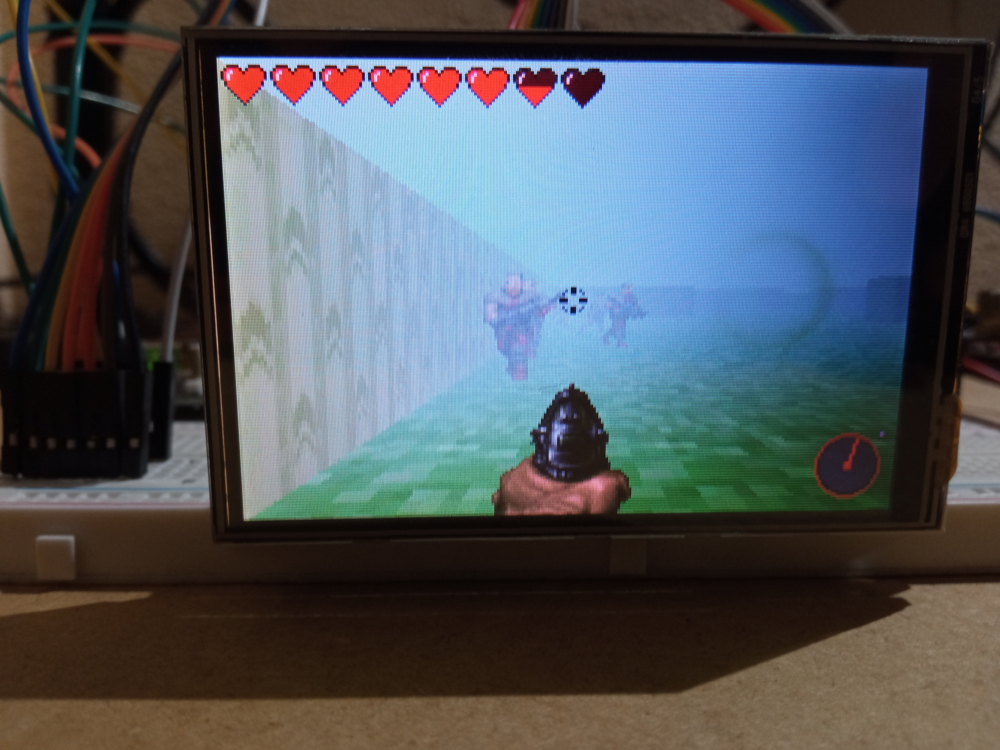
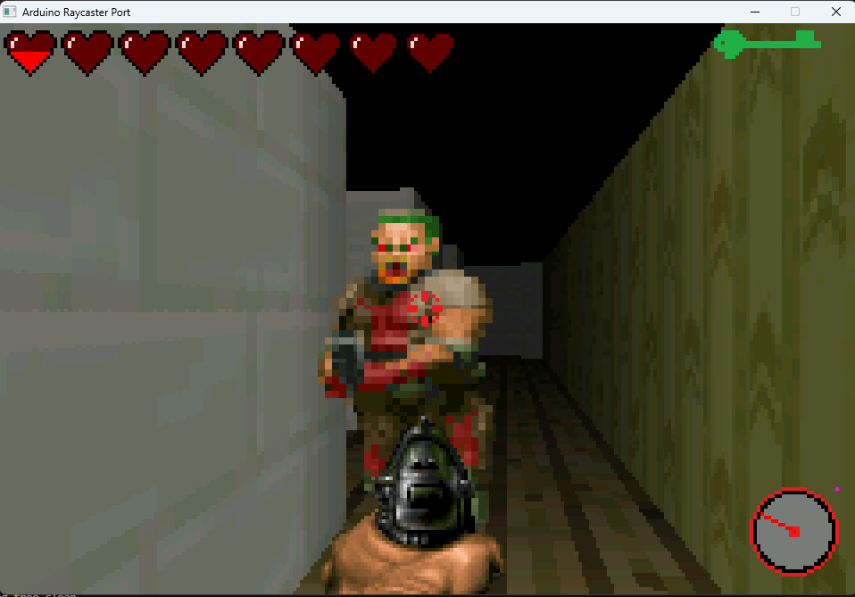

# Arduino Raycaster

This is a PlatformIO project with esp32 that is a raycaster able to run on esp32, inspired in universally known game 1993's Doom and Wolfestein 3D.

## The game

The game is a raycaster inspired by this in this [tutorial](https://lodev.org/cgtutor/raycasting.html) that works in a resolution of 240x160 px, the quarter of the screen's resolution, so the screen buffer can be held in esp32's RAM, making the entire code more portable. The objective of the game is catch the keys, going to the doors, avoiding the enemys.
Some of the sprites are taken from 1993's Doom and some textures from Minecraft.
:exclamation: The level 2 is not finished completely!

## Hardware
It is made with a Lilygo T3 v1.6 LoRa 32 as the main processor, a 3.5 inch TFT9846 screen as the display, an Arduino Mega 2560 as the peripheral receiver with one keypad and a PS2 mouse. The two controller communicate between them with I2C. The mouse and the keypad are not attached directly to the esp32 because there aren't enough pins to connect them.
This setup can run at an average of 65ms the frame, a bit more than 15 FPS, better than I thought at first, but worse than I'd like.


## SDL2 port

As the code is made with C++, I managed to separate almost all the game logic and I made it platform independent, so I've made a port of the game that runs with SDL2 in my Windows machine. It is controlled with the WASD keys and the mouse instead of the 2456 of the keypad and the old mouse.

:warning: The Makefile only works in Windows with Mingw32! (Although it may not be difficult to port it to Linux, I think)

1. Clone the repository: ```git clone https://github.com/dangarcar/esp32-raycaster```
2. Go to the test folder in raycaster: ```cd esp32-raycaster/raycaster/test```
3. Run make: ```make```
4. Play! (And don't forget Esc is the key to exit): 
